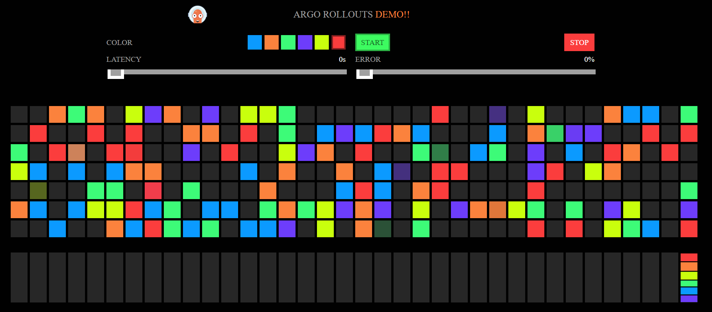

# Argo Rollouts Demo (Canary on EKS)

This repo contains the application source, Dockerfile, and Kubernetes manifests for an **Argo Rollouts canary deployment** on EKS. Two app versions are used: **v1.0** (header: *ARGO ROLLOUTS DEMO*) and **v2.0** (header: *ARGO ROLLOUTS DEMO!!*).



---

## Deliverables overview

| Item | Location |
|------|----------|
| **Dockerfile** | [`Dockerfile`](./Dockerfile) (multi-stage, distroless, non-root) |
| **Built image tags** | `girish514/rollouts-demo:v1.0`, `girish514/rollouts-demo:v2.0` |
| **Kubernetes manifests** | [`k8s/`](./k8s/): `rollout-canary.yaml`, `service.yaml`, `ingress.yaml` |

---

## Chosen strategy: Canary

Traffic is shifted gradually from the stable version to the new version:

1. **20%** traffic to canary → pause 60s  
2. **50%** traffic to canary → pause 60s  
3. **100%** (full promotion) when healthy  

The Rollout uses two services (stable + canary), NGINX ingress for traffic splitting, and HTTP readiness/liveness probes (`/`, `/healthz`) for resilience.

---

## Deploy and run

**Prerequisites:** Kubernetes cluster (e.g. EKS) with [Argo Rollouts](https://argoproj.github.io/argo-rollouts/getting-started/) and NGINX Ingress Controller installed.

**Optional:** Install the [Argo Rollouts kubectl plugin](https://argoproj.github.io/argo-rollouts/features/kubectl-plugin/) to watch rollouts and trigger updates:

```bash
# Linux (e.g. WSL)
curl -LO https://github.com/argoproj/argo-rollouts/releases/latest/download/kubectl-argo-rollouts-linux-amd64
chmod +x kubectl-argo-rollouts-linux-amd64
sudo mv kubectl-argo-rollouts-linux-amd64 /usr/local/bin/kubectl-argo-rollouts
```

```bash
# Deploy (baseline v1.0)
kubectl apply -f k8s/service.yaml
kubectl apply -f k8s/rollout-canary.yaml
kubectl apply -f k8s/ingress.yaml

# Trigger canary to v2.0 (with plugin)
kubectl argo rollouts set image rollouts-demo rollouts-demo=girish514/rollouts-demo:v2.0

# Watch rollout (recommended with plugin)
kubectl argo rollouts get rollout rollouts-demo --watch
```

Without the plugin, use:

```bash
# Trigger canary
kubectl patch rollout/rollouts-demo --type merge -p '{"spec":{"template":{"spec":{"containers":[{"name":"rollouts-demo","image":"girish514/rollouts-demo:v2.0"}]}}}}'

# Watch
kubectl describe rollout rollouts-demo
```

Use the LoadBalancer hostname from `kubectl get svc rollouts-demo` (or your ingress host) to open the app in a browser and confirm the header change from *DEMO* to *DEMO!!* as the canary completes.

---

## Rollback (failure handling)

To simulate a bad release and then roll back to the last good version:

```bash
# Simulate bad image
kubectl patch rollout/rollouts-demo --type merge -p '{"spec":{"template":{"spec":{"containers":[{"name":"rollouts-demo","image":"girish514/rollouts-demo:nonexistent"}]}}}}'

# Roll back to v1.0 (patch works with or without plugin)
kubectl patch rollout/rollouts-demo --type merge -p '{"spec":{"template":{"spec":{"containers":[{"name":"rollouts-demo","image":"girish514/rollouts-demo:v1.0"}]}}}}'
```

With the Argo Rollouts plugin you can also use:

```bash
kubectl argo rollouts abort rollouts-demo    # abort current rollout
kubectl argo rollouts undo rollouts-demo    # revert to previous revision
```

---

## AWS/EKS mapping

| This solution | AWS/EKS equivalent |
|---------------|---------------------|
| Application pods | EKS managed node groups / Fargate |
| `girish514/rollouts-demo` on Docker Hub | ECR repository |
| Service `type: LoadBalancer` | NLB/CLB (or ALB via AWS Load Balancer Controller) |
| NGINX Ingress | ALB Ingress Controller + `ingressClassName: alb` (adjust Rollout `trafficRouting` to `alb`) |
| Argo Rollouts controller | Runs in cluster (e.g. `argo-rollouts` namespace) |
| Readiness/liveness probes | Kubernetes self-healing + Rollouts health checks |

---

## Source and image build

- **Source:** Go backend and static assets in this repo; images built from this source (no pre-built image use).
- **Build and push:**
  ```bash
  docker build -t girish514/rollouts-demo:v1.0 .
  docker push girish514/rollouts-demo:v1.0
  # After changes for v2 (e.g. UI), tag and push v2.0
  docker build -t girish514/rollouts-demo:v2.0 .
  docker push girish514/rollouts-demo:v2.0
  ```
